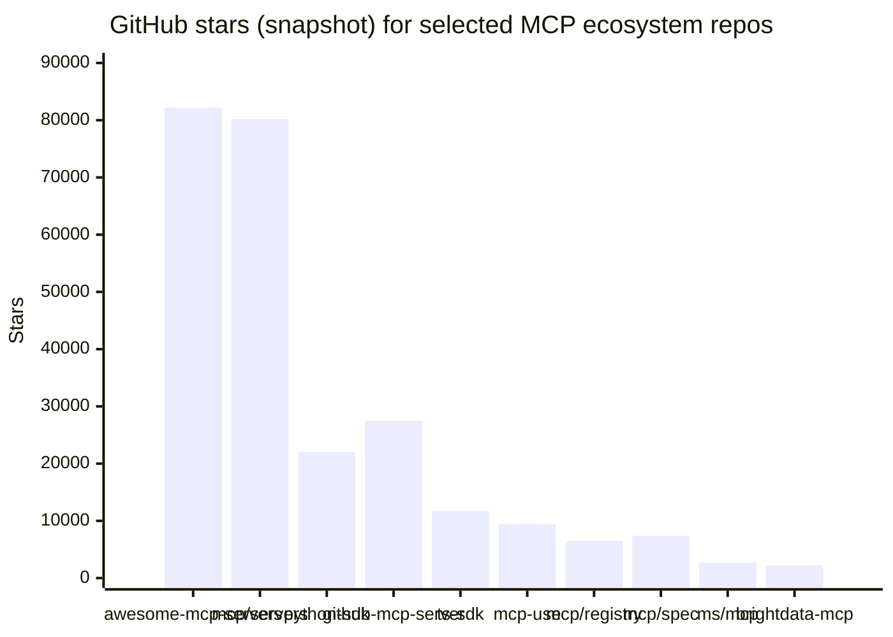
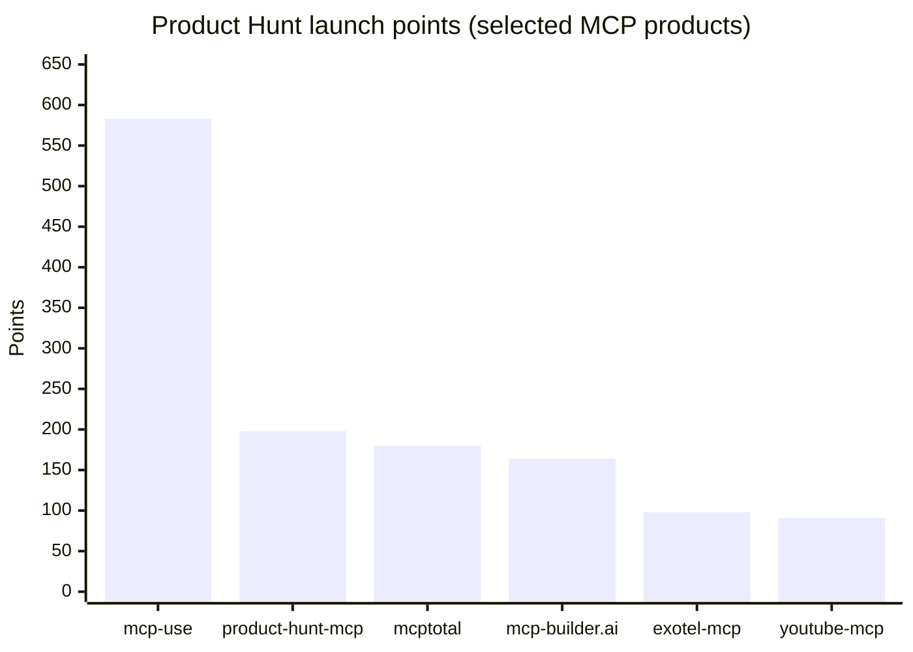
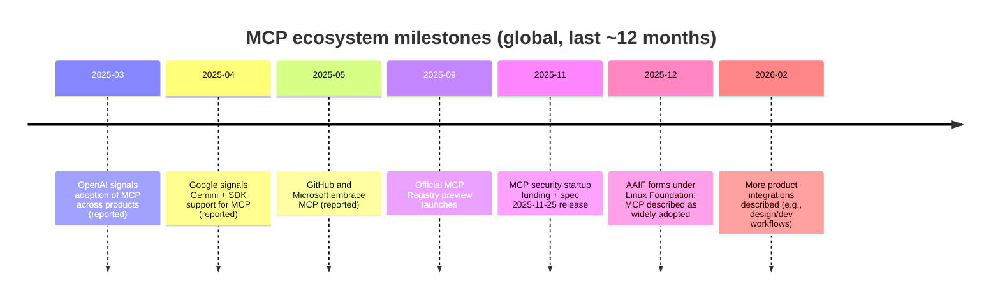
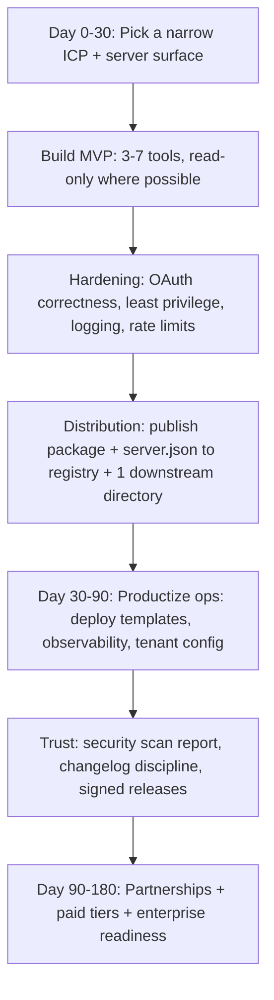

# Is Building MCP Servers a Viable Solo Venture?

## Executive Summary

Building and commercializing MCP servers can be a viable solo venture in 2025–2026, but the “build a thin connector and charge for it” play is rapidly commoditizing. The strongest solo opportunities have shifted toward: (a) *trust and security layers* (scanning, policy, auditability), (b) *operations layers* (managed remote hosting, auth, observability, multi-tenant gateways), and (c) *high-stakes vertical connectors* where compliance and reliability matter more than raw feature count. citeturn32view0turn18view0turn19view3turn1view1turn38search4

Over the last 12 months (global scope; roughly 2025-03-05 to 2026-03-05), MCP has moved from “promising protocol” to “default integration path” for agentic tooling, with platform-scale adoption signals such as public commitments and rollouts described by entity["company","OpenAI","ai research company"], entity["company","Google","technology company"], entity["company","GitHub","code hosting platform"], and entity["company","Microsoft","technology company"], plus continued standardization under entity["organization","The Linux Foundation","open source nonprofit"] via entity["organization","Agentic AI Foundation (AAIF)","linux foundation directed fund"]. citeturn17view3turn17view4turn17view5turn17view0turn17view1

This same acceleration increases competitive pressure. Open-source “reference” servers explicitly caution they are *not production-ready*, and real security advisories/CVEs have already been filed against widely used MCP server components—an early warning that production MCP is a security product, not just an API wrapper. citeturn7view0turn19view3turn38search4turn38search1

The remaining market scope is large because the official registry is designed to be unopinionated and delegates deeper moderation and security scanning to downstream aggregators/marketplaces, leaving room for third-party businesses that add trust, curation, compliance, and operational guarantees. citeturn18view0turn22view0turn19view0turn19view1

Data limitations and assumptions: (1) many GitHub “stars/month” values are not directly exposed in a stable, machine-readable way in official HTML; this report uses star counts, forks, contributor/release activity, and external launch metrics (e.g., Product Hunt points) as practical momentum proxies; (2) X/Twitter pages are often not fully extractable via automated viewing, so “trend signals” rely primarily on accessible reposts, media coverage, and platform announcements; (3) registry UI and some API docs render dynamically, limiting direct “total server count” extraction from the UI—this report uses official press statements as the best available proxy. citeturn9view0turn20view0turn32view0

## MCP ecosystem signals in the last year

### Standardization and governance momentum

MCP is formally specified as an open protocol using JSON-RPC 2.0 with a host–client–server architecture for exposing tools/resources/prompts and exchanging context. citeturn3view2turn2search10 The protocol’s security posture and enterprise readiness have been strengthened through explicit OAuth-based authorization requirements (OAuth 2.1 resource server/client roles, protected resource metadata, and discovery mechanisms). citeturn3view1turn2search2

The 2025-11-25 specification release (within the window) added/clarified several features that matter commercially for MCP server builders: improved auth discovery, incremental scope consent, URL-mode elicitation, tool calling parameters in sampling, and experimental “tasks” for durable requests with polling/deferred results. citeturn3view3turn2search0

A major macro-signal is the creation of AAIF under the Linux Foundation, with MCP cited as a foundational standard and supported by a broad coalition of major companies (membership lists in the announcement/press materials). citeturn17view0turn32view0turn17view1

### Distribution and discovery via the official registry

The official MCP Registry is in preview and positioned as a centralized metadata repository (not an artifact store) with standardized `server.json` metadata, namespace verification (reverse-DNS style names), and a REST API intended primarily for downstream aggregators/marketplaces. citeturn18view0turn22view0turn3view4

Crucially for “solo venture” scope, the registry intentionally leaves room for value-added layers: aggregators are explicitly described as places to add ratings and security scanning, and the registry itself disclaims uptime/data durability guarantees. citeturn22view0turn18view0 The moderation policy is also intentionally permissive and explicitly warns consumers to assume minimal-to-no moderation—another strong incentive for third-party trust layers. citeturn19view0turn19view1

### Platform adoption and productization signals

Within the time window, public reporting describes broad platform support signals, including commitments that MCP support is/was being added across major AI products and developer tools. citeturn17view3turn17view4turn17view5turn32view0

At the product layer, multiple organizations launched or highlighted MCP servers as part of their commercial offerings (examples include “managed MCP servers” and MCP-based integrations reported by tech press). citeturn17view6turn17view9turn17view10 This matters for solo founders because it validates MCP servers as a distribution surface: they are not merely “integration glue” but are increasingly treated as first-class product endpoints. citeturn17view6turn18view0

### Community traction proxies: GitHub, Product Hunt, Reddit, Wellfound

GitHub popularity of MCP-related repos is unusually high for a 12–18 month-old ecosystem, suggesting sustained developer attention and a fast-growing surface area.

The star counts above are taken from GitHub repository metadata snapshots in this research window. citeturn8view2turn8view0turn37view4turn34view0turn34view2turn37view0turn8view4turn8view3turn7view1turn7view5

On entity["company","Product Hunt","product discovery platform"], MCP-focused infrastructure and tooling products have achieved strong day-rank and point totals (a useful demand proxy for early developer ecosystems). For example, **mcp-use** (#2 of the day; 583 points) and **MCPTotal** (#5 of the day; 180 points) show explicit interest in deployment, security, and “hub/gateway” value propositions. citeturn6view0turn6view2

Points shown from Product Hunt product pages for each launch. citeturn6view0turn6view4turn6view2turn6view3turn5view5turn6view5

Reddit discussions in entrepreneur/indie maker communities reinforce the same commercial theme: builders ask for MCP “stores/marketplaces,” and commenters explicitly value versioning, auth, and billing/rollback/analytics—i.e., operational and trust layers, not just endpoints. citeturn15view2turn15view0turn16search0turn16search16

Finally, hiring and company descriptions on entity["company","Wellfound","startup job platform"] increasingly reference MCP server experience (both in product descriptions and roles), indicating enterprise/platform demand beyond hobby projects. citeturn7view8turn4search9turn4search13

### Timeline of ecosystem milestones in-scope

Timeline items are derived from official project posts and coverage in the requested sources. citeturn17view3turn17view4turn17view5turn3view4turn3view3turn17view7turn17view0turn17view10

## Feasibility for a solo founder to build and commercialize an MCP server

### Technical feasibility

A solo founder can build a functional MCP server quickly using official SDKs (notably the Python and TypeScript SDKs), which include server/client abstractions and example quickstarts. citeturn37view4turn34view2turn33view4turn3view2 The official docs also ship tooling like the MCP Inspector (via `npx`) for testing/debugging, which materially lowers the solo “time-to-working-demo.” citeturn19view4turn18view5

For distribution, the official registry provides a clear publishing path: publish artifacts to a package registry (e.g., npm) and publish standardized metadata to the MCP Registry using an official CLI (`mcp-publisher`) and a `server.json` format. citeturn18view1turn18view0 This makes MCP servers unusually “solo friendly” compared with bespoke plugin ecosystems because your primary work is (a) implementing tools/resources and (b) packaging + metadata + auth. citeturn18view1turn22view0

However, the protocol’s direction of travel increases technical scope. Remote MCP servers and stronger auth flows imply you need comfort with OAuth 2.1-style resource server correctness, token validation, and correct discovery flows, not just “API calls.” citeturn3view1turn19view2turn3view3

### Security feasibility and the “production tax”

MCP server security is not theoretical: the official MCP servers repository explicitly warns that reference implementations are educational and not production-ready, and encourages developers to evaluate security requirements and safeguards. citeturn7view0turn35search3

The official “Security Best Practices” documentation enumerates risks such as token passthrough, SSRF, session hijacking variants, local MCP server compromise, and the need for scope minimization—security work that often becomes the majority of “real product” effort. citeturn19view3turn3view1

Concrete advisory evidence exists: GitHub’s reviewed advisory for **CVE-2025-68143** describes how an MCP Git server tool (`git_init`) accepted arbitrary filesystem paths (pre-2025.9.25), creating risk for unauthorized file access and chaining attacks, and the NVD entry explains the affected behavior. citeturn38search4turn38search1 For a solo venture, this implies your differentiation must include security posture (sandboxing, least privilege, audit logs, secret isolation), or you will be outcompeted by “trusted” providers and rejected by serious buyers. citeturn19view3turn38search4turn19view1

Academic literature in the last year also frames MCP as early-stage with open challenges in security, tool discoverability, and deployment, and proposes threat taxonomies and lifecycle phases that map well to product requirements. citeturn1view0turn1view1

### Legal/compliance feasibility by vertical

Commercial MCP servers commonly handle sensitive data or privileged actions, which quickly introduces regulated obligations.

Healthcare: if your server creates/receives/maintains/transmits PHI on behalf of covered entities or business associates, a cloud service provider can be treated as a HIPAA business associate and must comply with HIPAA rules; HHS guidance on cloud computing and business associates is explicit on this point. citeturn27search2turn27search6

Finance: GLBA-related obligations for financial institutions include privacy notice/opt-out requirements and safeguarding customer information; FTC guidance outlines the GLBA Privacy Rule obligations for covered institutions. citeturn28search2turn28search6

Legal: professional confidentiality duties are strict; ABA Model Rule 1.6 prohibits revealing information relating to representation without informed consent (subject to exceptions). citeturn28search0turn28search4

Ecommerce/payments: PCI standards apply to organizations that process/store/transmit cardholder data; the PCI SSC quick reference guide frames PCI DSS as the global standard adopted by card brands for such organizations. citeturn31view0turn31view1

A practical solo-founder implication: regulated vertical MCP servers are feasible but require either (a) strict architectural boundarying (keep regulated data out of your infrastructure via “customer-hosted” deployment), or (b) pricing and operations that can fund audits, legal review, and security engineering. citeturn19view3turn27search2turn31view0

### Operational and go-to-market feasibility

Operationally, MCP distinguishes between local and remote servers, and remote connectivity transforms the server into an internet-facing service in many cases, changing your risk profile (uptime, authentication, rate limiting, monitoring). citeturn19view2turn3view1

From a distribution standpoint, MCP is unusually favorable to solo founders because the ecosystem has multiple “market entry” doors: the official registry; downstream aggregators/marketplaces; and devtool environments integrating MCP servers into IDE workflows. citeturn18view0turn22view0turn34view3turn33view5 That said, the official registry terms explicitly disclaim warranties and responsibility for server safety, so commercial success depends on establishing trust signals beyond being “listed.” citeturn19view1turn19view0

## Market scope and competitive landscape

### Who buys MCP servers and why

The addressable customer set is broader than “indie hackers.” It includes: (a) tool/platform companies exposing their APIs as MCP servers to meet agentic demand; (b) enterprises deploying internal MCP servers (private registries and controlled access); and (c) developers using MCP-compatible clients (e.g., IDE agents) who want higher-quality integrations. citeturn18view0turn19view2turn32view0turn33view5

Demand concentrates where MCP changes the unit economics of work: “talk to data” workflows, automated reporting/analysis, QA/testing automation, and development lifecycle automation. These patterns are visible in community builds (e.g., MCP powering “talk to marketing data” dashboards) and in commercial claims about routing/auth/observability layers. citeturn15view1turn6view1turn6view2turn36view1

### Market sizing approach and what the numbers imply

Direct “MCP server market size” is not yet standardized in public research, so the most defensible sizing approach is adjacency: MCP servers compete within integration and automation budgets (iPaaS, workflow automation, API integration, and RPA-like automation with modern LLM interfaces).

Public market research estimates suggest iPaaS is already a large and growing category (e.g., Fortune Business Insights estimates ~$15.63B in 2025 and growth thereafter). citeturn27search32 RPA estimates also indicate a large automation market (e.g., Fortune Business Insights reports ~$22.58B in 2025 with continued growth). citeturn27search9

Within that adjacency frame, MCP’s near-term monetizable scope is plausibly *hundreds of millions to low single-digit billions* globally, because: (1) MCP is being positioned as a universal integration layer in open governance settings; (2) a large ecosystem of published servers exists; and (3) enterprise deployment requires governance layers buyers are accustomed to paying for (auth, audit logs, policy, uptime). citeturn32view0turn18view0turn22view0turn19view1

A key ecosystem proxy is the Linux Foundation press material stating “more than 10,000 published MCP servers,” which implies both a large supply surface and a large need for discovery, trust, and operational management. citeturn32view0

### Competitive landscape and saturation indicators

Competition is already bifurcated:

Open-source and “official” layers are strong. The core servers repo is ~80k stars and the curated server list repo is ~82k stars (both unusually high), implying that “basic connectivity” will become table stakes rather than a moat. citeturn8view0turn8view2 Official SDK repos also show high momentum (e.g., Python SDK ~22k stars; TypeScript SDK ~11.8k stars). citeturn37view4turn34view2

Platform vendors are shipping official servers and catalogs (e.g., GitHub’s official MCP server ~27.5k stars; Microsoft’s MCP catalog and servers). citeturn34view0turn7view1turn33view5

Infrastructure startups/devtools are emerging around gateways, security, and managed OAuth/observability (e.g., mcp-use ~9.4k stars; Product Hunt launch performance; and venture/commercial references). citeturn37view0turn6view0turn35search17turn17view7

Saturation indicators: (1) multiple directories/“awesome lists” with massive attention; (2) official registry plus downstream registries; (3) repeated community requests for “marketplace/gateway/config manager” products, suggesting a “platformization” phase. citeturn8view2turn18view0turn16search13turn15view2turn22view0

### Where scope still remains for solo ventures

The official registry’s architecture leaves a structural gap: it is a metadata source of truth, not a trust authority, and it explicitly expects aggregators to add value like scanning and ratings. citeturn22view0turn19view0turn18view0 Combined with real-world vulnerabilities in MCP server implementations, this creates strong market pull for tools that reduce risk and operational friction. citeturn38search4turn38search1turn19view3

## Ranked opportunities and top MCP server ideas

Ranking criteria used here: (a) **growth momentum** (signals from GitHub stars, release cadence, Product Hunt launch performance, and press/hiring signals), (b) **solo feasibility** (build + sell + operate within reasonable time), (c) **defensibility** (trust/compliance/data access moats), and (d) **risk** (security/regulatory + platform dependency + competition). citeturn6view0turn8view0turn19view3turn32view0turn7view8

### Comparison table of the top ideas

| Idea | Vertical | Target customer | Revenue model | Typical initial price | Technical complexity | Regulatory risk | Competition level | Momentum signals (proxies) | Est. TAM / SAM (assumptions) |
|---|---|---|---|---|---|---|---|---|---|
| Enterprise MCP gateway + policy engine | Cross-industry | Mid-market/enterprise agent teams | SaaS subscription + usage | $299–$2,500/mo | High | Med | High | “Gateway/Auth/Observability” products trending; enterprises cited as blocked on auth/audit gaps | TAM: slice of iPaaS; SAM: MCP teams needing governance citeturn27search32turn6view2turn6view1turn36view1turn22view0 |
| MCP security scanning + reputation registry | Security | DevSecOps, platforms, marketplaces | Per-scan + subscription | $99–$999/mo | Med–High | Med | Med | Registry delegates scanning; minimal moderation; real CVEs published | TAM: AppSec-like; SAM: marketplaces + enterprises adopting MCP citeturn22view0turn19view0turn38search4turn38search1turn17view7 |
| Managed OAuth + secrets + tenant isolation for MCP servers | Cross-industry | SaaS builders shipping MCP servers | Subscription per server/tenant | $49–$499/mo | High | Med | High | OAuth 2.1 requirements; auth complexity increases; builders cite auth as blocker | TAM: integration/identity spend; SAM: MCP server publishers citeturn3view1turn6view1turn18view0turn32view0 |
| “Verified docs” MCP server for a vendor ecosystem | Developer tools | Developers using IDE agents | Freemium + enterprise | $0–$49/user/mo | Med | Low | Med | Microsoft shows demand to reduce hallucinations via trusted docs | TAM: dev tooling; SAM: one ecosystem’s developer base citeturn33view3turn19view2turn32view0 |
| Marketing & analytics “talk-to-data” MCP server | Marketing analytics | Agencies + SMBs | Subscription per client | $49–$299/mo | Med | Low | Med | Community example shows value of “talk to marketing APIs”; growing MCP adoption | TAM: analytics automation; SAM: agencies/SMBs adopting LLM analytics citeturn15view1turn19view2turn32view0 |
| Test/QA automation MCP server | Dev productivity | Dev teams | Seat-based + usage | $20–$200/user/mo | Med | Low | Med | Wellfound company descriptions link testing workflows to MCP | TAM: software testing tooling; SAM: teams using IDE agents citeturn7view8turn19view2turn32view0 |
| Regulated finance research MCP server | Finance | Investment research, compliance teams | High-ticket subscription | $500–$10k/mo | High | High | Med | AAIF quotes emphasize regulated finance requirements; new security startups | TAM: finance data/ops; SAM: regulated teams adopting agent workflows citeturn32view0turn17view7turn19view3 |
| Legal DMS + contract workflow MCP server | Legal | Law firms, in-house legal | Subscription + services | $200–$2k/mo | High | High | Med | Confidentiality duties create “trust moat”; strong need for controlled tool access | TAM: legal ops; SAM: firms piloting agents with governance citeturn28search0turn19view3turn32view0 |
| Ecommerce ops MCP server (orders, refunds, support) | Ecommerce | DTC brands, ops teams | Subscription | $29–$299/mo | Med | Med | High | Payment/data compliance constraints; MCP used across business tools | TAM: ecommerce tooling; SAM: brands adopting agentic ops citeturn31view0turn19view2turn32view0 |
| Web access & extraction MCP server (niche, compliant) | Data | Researchers, growth teams | Usage-based | $0.01–$0.10/request | Med–High | Med | High | Strong existing repo momentum in web access MCP servers | TAM: data extraction/automation; SAM: agent builders needing reliable web tools citeturn7view5turn11search18turn19view3 |

“SAM/TAM” here are directional. The best defensible macro anchors are integration (iPaaS) and automation (RPA) market sizes; individual MCP server ideas generally map to slices of those budgets, plus vertical software spend. citeturn27search32turn27search9turn32view0

### The top ideas explained with evidence, monetization, and agentic AI leverage

**Enterprise MCP gateway + policy engine (rank: highest momentum, medium risk).**  
Definition: a control plane + data plane that routes tool calls to MCP servers, enforces policy (RBAC/ABAC), provides audit logs, and reduces “tool sprawl” by curating toolsets per context. This aligns with real buyer pain: builders explicitly cite missing auth/audit/observability and scattered configs as blockers. citeturn6view1turn15view2turn22view0  
Representative signals: gateway-focused products launched on Product Hunt (e.g., MCPTotal “secure hub/gateway” messaging; mcp-use “control plane/gateway” positioning), and vendor projects like Microsoft’s MCP gateway reflecting enterprise demand. citeturn6view2turn6view1turn36view1turn37view1  
Revenue models: subscription per workspace + usage (requests, tool executions) with add-ons for SSO/SIEM export. Pricing sanity: start with $299–$999/mo for 3–10 servers + usage tiers, then enterprise.  
Skillset/stack: TypeScript/Go services, OAuth/OIDC, policy engine (OPA/Rego-style), Redis/Postgres, structured logging, metrics; hardening based on MCP security guidance. citeturn19view3turn3view1turn22view0  
Agentic AI leverage: run “policy-as-code copilots” that propose least-privilege scopes and toolsets; use durable “tasks” patterns for long-running governance checks (e.g., scan before enable). citeturn3view3turn19view3turn18view0

**MCP security scanning + reputation registry (rank: very high defensibility, medium–high risk).**  
Definition: a security scoring and scanning layer for MCP servers (SBOM, dependency CVEs, “prompt injection hardening” checks, filesystem/network capability analysis), exposed via API and UI for marketplaces and enterprises.  
Evidence: the official registry explicitly delegates security scanning to package registries and downstream aggregators and warns of minimal moderation; real vulnerabilities have been published in MCP server components via GitHub advisory and NVD. citeturn18view0turn19view0turn38search4turn38search1turn22view0  
Competitive landscape: a funded security startup focused on MCP suggests this space is considered venture-scale, but that doesn’t eliminate solo scope—many buyers need “good enough” internal scanning and compliance reporting. citeturn17view7turn32view0  
Revenue models: per-scan API + annual enterprise plans; a solo can start with a hosted scanner for the top 100–500 servers used by a company.  
Agentic AI leverage: autonomous agents triage advisories, open PRs to patch configs, generate “safe toolset” profiles, and continuously re-scan after dependency changes. citeturn19view3turn38search4turn22view0

**Managed OAuth + secrets + tenant isolation for MCP servers (rank: high momentum, high complexity).**  
Definition: an MCP-native “auth and secrets fabric” that issues/rotates credentials, handles OAuth flows correctly, provides per-tenant isolation, and exposes an admin plane for access control.  
Evidence: the spec requires OAuth 2.1-compatible behaviors and token validation constraints; changelog updates add incremental scope consent and discovery improvements, which increase correctness requirements. citeturn3view1turn3view3turn2search2  
Market signal: multiple products explicitly sell “secure managed MCP,” and community asks for marketplaces that solve auth, billing, and versioning. citeturn6view2turn15view2turn32view0

**“Verified documentation” MCP servers for ecosystems (rank: high solo-feasibility, medium defensibility).**  
Definition: a server that provides trusted, up-to-date documentation and code samples for an ecosystem, reducing hallucinations by constraining sources.  
Evidence: Microsoft’s Learn MCP server explicitly positions itself as a way to avoid risky web search and hallucinations by using first-party docs. citeturn33view3turn34view1  
Opportunity scope: replicate this model for other ecosystems (cloud providers, API vendors, internal enterprise doc portals), especially where LLM coding agents struggle with version drift. citeturn33view3turn19view2turn32view0

**Marketing & analytics “talk-to-data” MCP servers (rank: high practicality, medium competition).**  
Definition: MCP servers that expose analytics and ad platform data tools (read-only first) so agents can analyze real performance.  
Demand signal: community example shows immediate value in letting the agent query real GA/ads data rather than giving generic advice. citeturn15view1turn19view2  
Solo wedge: start read-only + caching + strong audit (most agencies value trust and correctness). Expand later to automated actions (pause ads, create experiments) only after governance.

## Go-to-market playbook, pricing, and risks

### Roadmap for a solo founder

This roadmap mirrors how the ecosystem expects servers to be published and discovered (package registry + MCP registry metadata + downstream aggregators), and it foregrounds security hardening because official guidance and real CVEs show that MCP servers can become “high privilege” attack surfaces. citeturn18view1turn22view0turn19view3turn38search4turn7view0

### Revenue models and pricing playbooks that work for solo MCP ventures

A solo MCP server business tends to work best with one of three models:

Open-core server + paid hosting/governance: publish a usable open-source server, but charge for hosted remote deployment, SSO, audit logs, and policy. This matches observed market pull toward control-plane products. citeturn6view1turn6view2turn22view0

Usage-based “API MCP” servers: charge per tool invocation or per successful workflow (especially for data extraction or expensive upstream APIs). This aligns with the “servers as endpoints” model described in remote MCP usage. citeturn19view2turn7view5

Compliance-grade vertical SaaS: charge higher monthly subscriptions for regulated verticals, because the cost center is security and compliance evidence (HIPAA/GLBA/PCI, confidentiality). citeturn27search2turn28search2turn31view0turn28search0

Pricing experiments that fit MCP realities: (1) per-server tiering (1 server vs 10 vs 100), (2) “requests per month” bundles (like API metering), (3) “toolset packs” per vertical (finance pack, marketing pack), and (4) enterprise add-ons (SOC 2 report, SSO, SIEM export). SOC 2 is often requested as assurance for service organizations handling customer data, which is directly relevant to hosted MCP services. citeturn28search3turn19view1

### How agentic AI can accelerate building and operating your MCP server

Agentic AI can reduce solo execution time in several concrete ways:

Build acceleration: use coding agents with repository guidance standards (AGENTS.md is positioned as a universal agent guidance format) to generate server scaffolds, tests, and packaging consistently. citeturn17view0turn2search15turn32view0

Testing and debugging: integrate the MCP Inspector into CI-like workflows for tool schema validation and regression tests, and apply the security best practice checklist to automate negative tests (SSRF attempts, token passthrough attempts). citeturn19view4turn19view3

Operational automation: agents can (a) watch for upstream API changes, (b) regenerate OpenAPI-derived tool schemas, (c) rotate secrets and validate OAuth scopes, and (d) continuously scan dependencies for disclosed CVEs. The existence of real advisories in MCP server components makes “continuous scanning” more than a nice-to-have. citeturn38search4turn19view3turn3view1

Marketing automation: agents can produce launch assets and documentation, but the strongest lever is still *integration reach*—publish to the registry and get picked up by downstream directories/marketplaces, which the official registry ecosystem explicitly anticipates. citeturn18view0turn22view0turn3view4

### Key risks, failure modes, and mitigations

Security failure via capability chaining and prompt injection is the dominant technical risk. Official security guidance enumerates common classes (SSRF, token passthrough, session hijack), and real advisories show that tools can be exploitable when they operate on privileged resources. Mitigation: least privilege, sandboxing, strict input validation, conservative toolsets, and continuous patching with transparent changelogs. citeturn19view3turn38search4turn38search1turn34view0

Platform dependency and commoditization: as major platforms and vendors ship “official” servers and registries, thin connectors get displaced. Mitigation: sell trust (compliance artifacts, auditability) and ops (governance, uptime, tenant isolation), or specialize in regulated/high-stakes workflows where buyers pay for assurance. citeturn34view0turn7view1turn18view0turn19view1turn27search2

Registry/marketplace fragility: the official registry is still preview and disclaims warranties/durability; relying on it as your only distribution or “trust badge” is risky. Mitigation: multi-channel distribution (registry + docs + downstream directories), and your own integrity signals (signing, reproducible builds, third-party audits). citeturn18view0turn19view1turn3view4